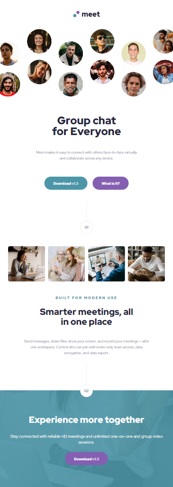
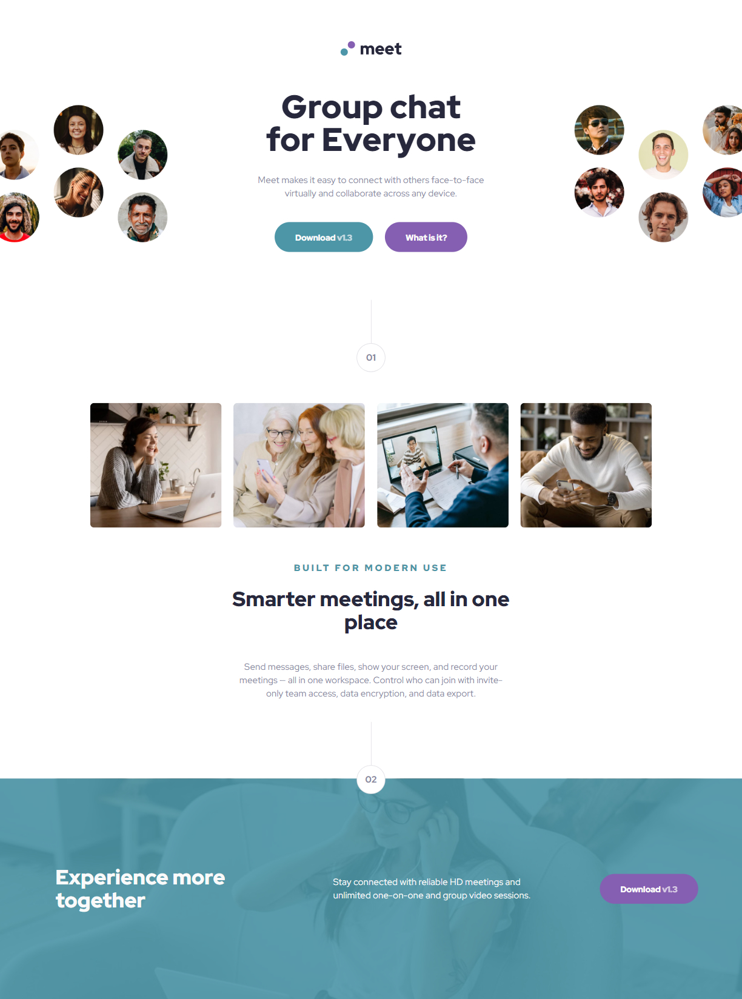

# Frontend Mentor - Meet landing page solution

This is a solution to the [Meet landing page challenge on Frontend Mentor](https://www.frontendmentor.io/challenges/meet-landing-page-rbTDS6OUR). Frontend Mentor challenges help you improve your coding skills by building realistic projects. 

## Table of contents

- [Overview](#overview)
- [Screenshot](#screenshot)
- [Links](#links)
- [My process](#my-process)
- [Built with](#built-with)
- [Author](#author)

## Overview

### Screenshot

### Links

- Solution URL: [Solution](https://github.com/Bartol857/meet-landing-page-challenge)
- Live Site URL: [Live site](https://bartol857.github.io/meet-landing-page-challenge/)

## My process

### Built with

- Semantic HTML5 markup
- CSS custom properties
- SASS
- BEM
- Flexbox
- GRID
- Mobile-first workflow

## Author

- Frontend Mentor - [@Bartol857](https://www.frontendmentor.io/profile/Bartol857)